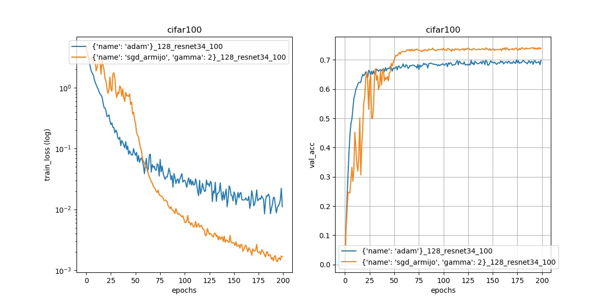

## Sls - Stochastic Line Search (NeurIPS2019) [[paper]](https://arxiv.org/abs/1905.09997)[[video]](https://www.youtube.com/watch?v=3Jx0tuZ1ERs)

Train faster and better with the SLS optimizer. The following 3 steps are there for getting started.

### 1. Installation
`pip install git+https://github.com/IssamLaradji/sls.git`

### 2. Usage
Use `Sls` in your code by adding the following script.

```python
import sls
opt = sls.Sls(model.parameters())

for epoch in range(100):
      # create loss closure
      closure = lambda : torch.nn.MSELoss()(model(X), y)

      # update parameters
      opt.zero_grad()
      loss = opt.step(closure=closure)
```

### 3. Experiments

Install the experiment requirements `pip install -r requirements.txt`

#### 2.1 MNIST
`python trainval.py -e mnist -sb ../results -d ../data -r 1`

where `-e` is the experiment group, `-sb` is the result directory, and `-d` is the dataset directory.

#### 2.2 Cifar100 experiment

`python trainval.py -e cifar100 -sb ../results -d ../data -r 1`

### 3. Results
#### 3.1 Launch Jupyter by running the following on terminal,

```
jupyter nbextension enable --py widgetsnbextension --sys-prefix
jupyter notebook
```

#### 3.2 On a Jupyter cell, run the following script,
```python
from haven import haven_jupyter as hj
from haven import haven_results as hr
from haven import haven_utils as hu

# path to where the experiments got saved
savedir_base = '../results'

# filter exps
filterby_list = [{'dataset':'cifar100', 'opt':{'c':0.5}}, 
                 {'dataset':'cifar100', 'opt':{'name':'adam'}}]
                 
# get experiments
rm = hr.ResultManager(savedir_base=savedir_base, 
                      filterby_list=filterby_list, 
                      verbose=0)
                      
# dashboard variables
legend_list = ['opt.name']
title_list = ['dataset', 'model']
y_metrics = ['train_loss', 'val_acc']

# launch dashboard
hj.get_dashboard(rm, vars(), wide_display=True)
```





#### Citation

```
@inproceedings{vaswani2019painless,
  title={Painless stochastic gradient: Interpolation, line-search, and convergence rates},
  author={Vaswani, Sharan and Mishkin, Aaron and Laradji, Issam and Schmidt, Mark and Gidel, Gauthier and Lacoste-Julien, Simon},
  booktitle={Advances in Neural Information Processing Systems},
  pages={3727--3740},
  year={2019}
}
```
It is a collaborative work between labs at MILA, Element AI, and UBC.
