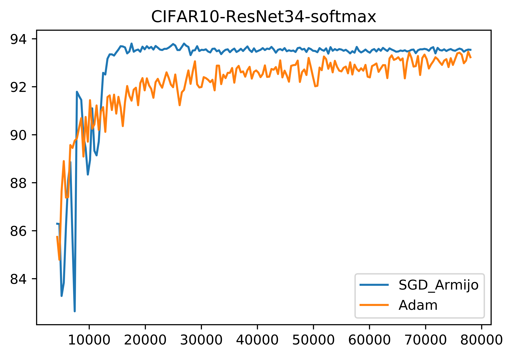

## Painless Stochastic Gradient [[paper]](https://arxiv.org/abs/1905.09997)

We propose SGD+Armijo, a stochastic line-search method that achieves superior generalization and convergence rate. SGD+Armijo outperforms both SGD and Adam on popular deep learning benchmarks. In addition, our method does not require setting the annoying step-size!


### (1) Using the SGD+Armijo optimizer in your project
To use our optimizer, you can follow these two steps,
  1. copy `sgd_armijo.py` and paste it to your folder; then
  2. define your optimizer something like,
  ```
  optimizer = sgd_armijo.SGD_Armijo(
            model,
            batch_size=16,
            dataset_size=len(train_set))
  ```


### (2) Reproducing the results
1. Optimize ResNet34 with Adam on CIFAR10:
```
python main.py -o Adam
```

2. Optimize ResNet34 with SGD_Armijo on CIFAR10:
```
python main.py -o SGD_Armijo
```

3. Use `plotting.ipynb` to save the following plot in `results/` after training:


