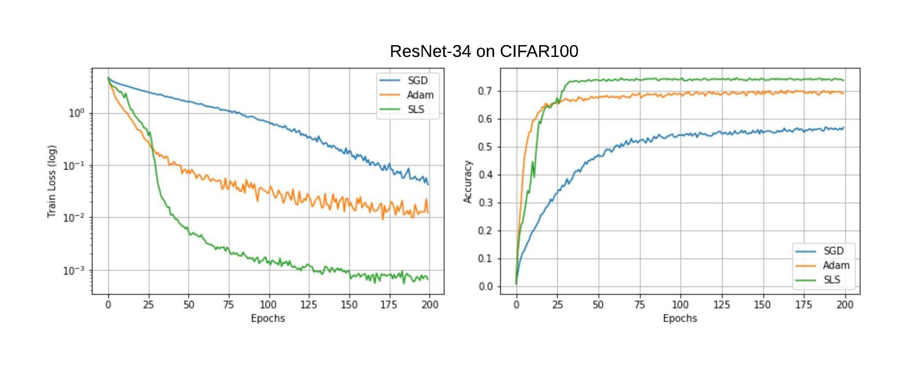

## Sls - Stochastic Line Search (NeurIPS2019) [[paper]](https://arxiv.org/abs/1905.09997)[[video]](https://www.youtube.com/watch?v=3Jx0tuZ1ERs)

Train faster and better with the SLS optimizer. The following 3 steps are there for getting started.


1. Install the optimizer,
    ```python
    pip install --upgrade git+https://github.com/IssamLaradji/sls.git
    ```


2. Define the SLS optimizer,
    ```python
    import sls
    opt = sls.Sls(model.parameters())

    # Alternative: the following results in better line search
    opt = sls.Sls(model.parameters(), n_batches_per_epoch=len(train_loader))
    ```

3. Update the model parameters,
    ```python
    for images, labels in train_loader:
        images, labels = images.cuda(), labels.cuda()

        opt.zero_grad()
        
        # this closure is necessary for performing line search
        def closure():
            probs = F.log_softmax(model(images), dim=1)
            loss = F.nll_loss(probs, labels, reduction="sum")
          
            return loss
            
    opt.step(closure)
    ```
  
  
## Experiments

### CIFAR100

- Run `python trainval.py -e cifar100 -sb <SAVEDIR_BASE> -d <DATADIR>`
  - `<SAVEDIR_BASE>` is the directory where the experiments are saved. 
  - `<DATADIR>` is the directory where the dataset is saved.
- View the results by running `python view_plots.py -e cifar100 -sb <SAVEDIR_BASE>`. It will save a plot as `results/cifar100.jpg`, which looks like the following,




### MNIST

- Run `python trainval.py -e mnist -sb <SAVEDIR_BASE>`
  - `<SAVEDIR_BASE>` is the directory where the experiments are saved.
- View the results by running `python view_plots.py -e mnist -sb <SAVEDIR_BASE>`. It will save a plot as `results/mnist.jpg`


<!--  -->

